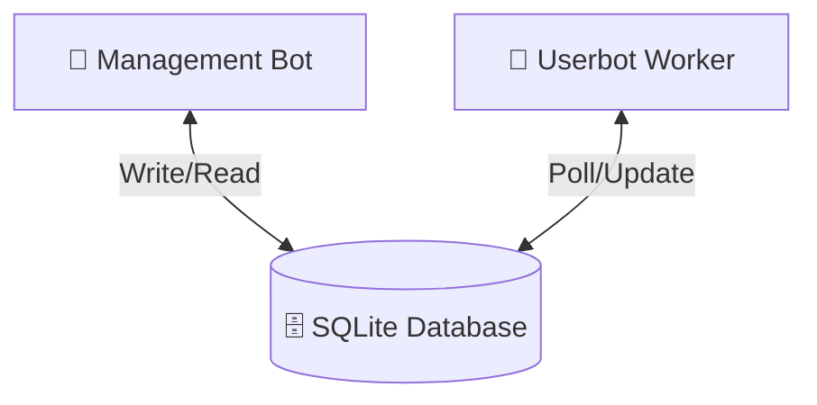

<div align="center">


**A production-ready Telegram content copier with a Hebrew management bot and a userbot worker.**

</div>

---

## 🏗️ Architecture

Two processes communicate exclusively through a shared SQLite database:

| Component | Library | Role |
|:---|:---|:---|
| 🤖 **Management bot** | `python-telegram-bot` | Hebrew UI, job creation, configuration |
| 👷 **Userbot worker** | `Telethon` | Executes copy jobs, updates progress |

> [!IMPORTANT]
> The bot **never** calls Telethon. The worker **never** touches the Bot API. SQLite is the only IPC channel.

### 🔄 Data Flow


---

## 📋 Requirements

- 🐍 Python 3.11+
- 👤 A Telegram account (for the userbot)
- 🤖 A Telegram bot token (from [@BotFather](https://t.me/BotFather))
- 🔑 API credentials from [my.telegram.org](https://my.telegram.org/apps)

---

## ⚙️ Setup

### 1️⃣ Install dependencies

```bash
pip install -r requirements.txt
```

### 2️⃣ Configure environment

Copy `.env.example` to `.env` and fill in all values:

```bash
cp .env.example .env
```

Required fields:
- `BOT_TOKEN` — from @BotFather
- `TELETHON_API_ID` and `TELETHON_API_HASH` — from my.telegram.org
- `TELETHON_SESSION` — path for the session file (e.g. `sessions/userbot`)
- `ADMIN_IDS` — comma-separated Telegram user IDs allowed to use the bot

### 3️⃣ Authenticate the userbot session

This is a one-time step. It asks for your phone number and a confirmation code sent to Telegram.

```bash
python main.py setup
```

### 4️⃣ Run the management bot

```bash
python main.py bot
```

### 5️⃣ Run the userbot worker (separate terminal)

```bash
python main.py worker
```

> [!NOTE]
> Both processes can run simultaneously. They coordinate through the database.

---

## 🎮 Usage

1. 🚀 Send `/start` to the management bot — a Hebrew control panel message appears
2. ➕ Add source and destination channels via the UI
3. 📝 Create a job (choose copy mode and parameters)
4. 📤 Submit the job — the worker picks it up automatically
5. 📊 Monitor progress in the job detail screen (press Refresh)

---

## 📋 Copy Modes

| Mode | Description |
|:---|:---|
| ♾️ **All messages** | Copy every accessible message in the source |
| 📅 **Date range** | Copy messages between two dates (DD/MM/YYYY HH:MM) |
| 🔢 **ID range** | Copy messages between two numeric message IDs |
| 🎯 **Single message** | Copy one specific message by ID |

---

## 📦 Content Types (v1)

- ✅ **Supported**: Text, photos, videos, documents/files (with captions)
- ❌ **Not supported**: Stickers, polls, live locations

---

## 🛡️ Blocked Words

Configure a list of blocked words in the bot UI. Any message containing a blocked word (in text or caption) is skipped entirely. No editing or partial removal — the whole message is skipped. The count of skipped messages is tracked per job.

---

## 🚑 Restart Recovery

The system is designed to survive process crashes:

- 🔄 **Worker crash mid-job**: On next startup, the worker detects that a job was `running` in the database and re-queues it as `pending`.
- 📍 **Resume from checkpoint**: The copy engine reads `last_processed_id` (the last fully committed message) and resumes from there.
- 🛡️ **Duplicate prevention**: The `copied_messages` table tracks every processed source message ID. Messages already in this table are never re-sent, even if the checkpoint is slightly stale.
- 🕒 **FloodWait handling**: If Telegram rate-limits the userbot, the job is moved to `waiting_retry` with a `next_retry_at` timestamp. On restart, the poll loop respects this timestamp.

---

## 🧱 Project Structure

```text
app/
├── 📄 config.py              # ⚙️ environment config
├── 📄 db.py                  # 🗄️ SQLite connection, schema init
├── 📄 models.py              # 📦 typed dataclasses
├── 📂 repositories/          # 🗃️ Database operations
│   ├── 📄 admin_repo.py
│   ├── 📄 job_repo.py
│   ├── 📄 source_repo.py
│   ├── 📄 filter_repo.py
│   └── 📄 state_repo.py
├── 📂 services/              # 🧠 Business logic
│   ├── 📄 job_service.py
│   └── 📄 validation_service.py
└── 📂 ui/                    # 🎨 Interface building
    ├── 📄 texts.py           # 🇮🇱 all Hebrew strings
    ├── 📄 keyboards.py
    └── 📄 renderer.py
bot/                          # 🤖 Management Bot
├── 📄 bot_main.py            
└── 📂 handlers/
worker/                       # 👷 Userbot Worker
├── 📄 worker_main.py         # 🔄 poll loop and recovery
├── 📄 copy_engine.py         # 🧠 Telethon copy logic
└── 📄 rate_limiter.py        # ⏳ FloodWait handling
📄 main.py                    # 🚀 entry point (bot | worker | setup)
```

---

## ⚠️ Safety Defaults

> [!TIP]
> All settings are adjustable via the Settings screen in the management bot.

- ⏱️ **Default delay** between messages: 1.5–4.0 seconds (random)
- 🛡️ **FloodWait buffer**: 5 extra seconds after the required wait
- 🔄 **Max retries**: 3 before marking a job as failed
- ⏸️ **Concurrency**: Only one job runs at a time — no parallel execution

---

<div align="center">

**Made with ❤️ by Omer**

</div>
